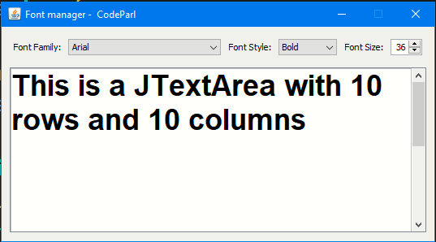

# JSwing Font Manager

## screenshot

## About this code

  In this code example we want to use the available system fonts to change the font family of a JTextArea. we will also change its style and size.Our class extends JPanel to layout its components.

## How to run this code

To run this code example, simply download the [jdk](https://www.oracle.com/java/technologies/javase-jdk16-downloads.html)  from oracle website and install it on your machine, then install [VSCode](https://code.visualstudio.com/download) and install it, then open the code example in VSCode. You must install java extension before working with this code example in VSCode.

## Author

This code example was writted by [Hassan Mugabo - aka Codeparl](https://github.com/codeparl)

## More code examples

For more code examples, please checkout [codeparl.com](https://codeparl.com)

## License

Licensed under MIT (https://github.com/codeparl/JSwing-Font-Manager/blob/master/LICENSE)